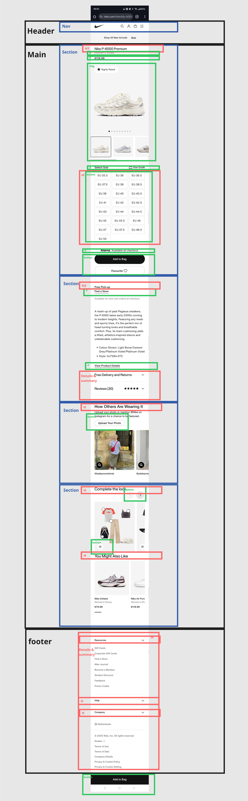
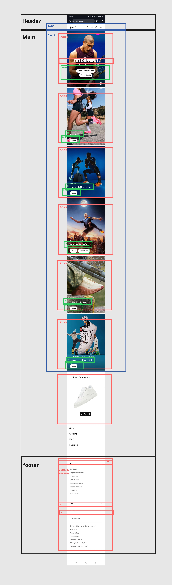

# Procesverslag
Markdown is een simpele manier om HTML te schrijven.  
Markdown cheat cheet: [Hulp bij het schrijven van Markdown](https://github.com/adam-p/markdown-here/wiki/Markdown-Cheatsheet).

Nb. De standaardstructuur en de spartaanse opmaak van de README.md zijn helemaal prima. Het gaat om de inhoud van je procesverslag. Besteedt de tijd voor pracht en praal aan je website.

Nb. Door *open* toe te voegen aan een *details* element kun je deze standaard open zetten. Fijn om dat steeds voor de relevante stuk(ken) te doen.

## Jij

  
uitwerken voor kick-off werkgroep

  ### Auteur:
  Sarah Seur

  #### Je startniveau:
  Rood

  #### Je focus:
  Responsive (of allebei)

## Je website

  
uitwerken voor kick-off werkgroep

  ### Je opdracht:
  Nike: nike.com

  #### Screenshot(s) van de eerste pagina (small screen): 
  Home pagina  
  
  

  Bronnen: 
  (Nike (Netherlands), z.d.)

  #### Screenshot(s) van de tweede pagina (small screen):
  Product pagina  
  
  
  

## Toegankelijkheidstest 1/2 (week 1)

  
uitwerken na test in 2e werkgroep

  
  
  
  
  

  ### Bevindingen
  Lijst met mijn bevindingen die in de test naar voren kwamen:
  * Media zoals achtergrond video's worden automatisch afgespeeld.
  * Video's kunnen niet op pauze.
  * Er zijn geen captions bij video's.
  * Veel links zien eruit als buttons op de site en andersom.
  * De font-size kan niet aangepast worden.
  * Er zitten veel foutmeldingen in de html.
  * Er wordt niet altijd 'simpele' taal gebruikt. Meer een verkoop praatje.
  * Op mobiel volgt de site bijna de WCAG richtlijnen, maar bij rotatie lukt dat alleen niet wanneer je de telefoon op de kop houdt.
  * De homepage houdt zich niet helemaal aan de H1, H2 etc. De titel van de pagina begint bij een H3 en andere kopjes worden ook zo gebruikt.

  #### Conclusie
  Over het algemeen lukt het Nike redelijk om zich aan de WCAG richtlijnen te houden, toch werkt er veel niet of is het gewoon simpelweg
  niet gecodeerd. De site van Nike gaat wel de goede kant op met 'mobile and touch' en 'color contrast'. Ik vind dat Nike een paar hele 
  belangrijke toegankelijkheids punten misloopt, zoals het niet kunnen aanpassen van de tekst grootte is voor veel mensen enorm belangrijk, 
  ook kunnen mensen verward raken doordat de links eruit zien als buttons etc. De mensen met een beperking kunnen dus niet altijd even 
  makkelijk de website gebruiken, denk aan slechtzienden en mensen die bijvoorbeeld niet goed tegen allerlei bewegingen kunnen.
  

  ### Screenreader
  In de les zijn we ook bezig geweest met een screenreader. Het was voor mij de eerste keer en het was een bijzondere ervaring. 
  Het werkt slecht. Het was nog al een overweldigende ervaring, maar het was wel heel erg interessant om er mee te werken. 
  Kijken naar wat wel goed werkt en wat niet. Ik heb de Nike site bekeken en de Uniqlo site (die een klasgenoot gaat namaken),
  wat wel snel duidelijk was geworden was dat de Nike site niet goed werkte met een screenreader. Er werden bijvoorbeeld URLs 
  opgenoemd van linkjes, dat duurt dus ontiegelijk lang, en je wordt er ook gewoon knettergek van. Ook was de alt op images 
  niet altijd duidelijk en kon je dus niet echt weten wat voor schoenen er nou te zien waren. Je kreeg bijvoorbeeld wel de
  naam te horen van de schoenen, maar als blinde of slechtziende heb je geen idee hoe ze er dan uit zien.
  
  #### Conclusie
  Ik heb door deze oefening geleerd hoe belangrijk het is dat websites goed werken met screenreaders. Soms veloor ik mijn 
  geduld, maar het was wel interessant om te zien waat het dan mis gaat en wat juist weer beter kan.

## Breakdownschets (week 1)

  
uitwerken na afloop 3e werkgroep

  ### de hele pagina: 

  ### Homepagina: 
  

  ### Productpagina: 
  

  De breakdown schetsen maken was goed te doen voor mij. Het is even kijken van "welke html elementen heb je ook alweer?". 
  Na even puzzelen en bedenken wat wat is heb ik twee duidelijke breakdown schetsen voor mezelf in elkaar gezet. Nu kan ik goed 
  beginnen met de html en weet ik al precies wat ik nodig moet hebben.

## Voortgang 1 (week 2)

  
uitwerken voor 1e voortgang

  ### Stand van zaken
  hier dit ging goed & dit was lastig (neem ook screenshots op van delen van je website en code)

  De huiswerk opdrachten en de opdrachten die we in de les deden gingen heel erg goed. Ik merkte wanneer ik de huiswerk opdrachten 
  maakten dat ik het dan makkelijk en snel begreep wat er in de les verteld werd. Soms waren opdrachten wat lastig en dan kwam ik 
  er even niet uit. Ik heb dan lang gepuzzeld of dingen opgezocht om te begrijpen waarom er iets niet werkt bijvoorbeeld.

  ### Agenda voor meeting
  samen met je groepje opstellen

  | student 1 (ik)                        | student 2                      | student 3                       | student 4 |
  |---------------------------------------|--------------------------------|---------------------------------|-----------|
  | Hoe kan ik het best beginnen?         | Hoe maak ik een hamburgermenu? | Hoe maak ik een hamburger menu? | Afwezig   |
  | Hoe kan ik mijn breakdown verbeteren? | -                              | -                               | Afwezig   |

  ### Verslag van meeting
  hier na afloop snel de uitkomsten van de meeting vastleggen

  - Het beste is om te beginnen met de volledige html en daarna de rest. Door de breakdown schetsen gemaakt te hebben kan 
    ik alles soort van al overtypen in de html.
  - Er waren nog een paar kleine verbeterpunten in mijn breakdowns. Zo miste ik bijvoorbeeld nog een 'ul' ergens, voor 
    de rest vonden zij dat ik het al erg goed had uitgewerkt.
  - Voor het hamburgermenu gaven zij als tip om de opdracht te gaan maken.

## Voortgang 2 (week 3)

  
uitwerken voor 2e voortgang

  ### Stand van zaken
  hier dit ging goed & dit was lastig (neem ook screenshots op van delen van je website en code)

  Het opstellen van de html en css was in het begin goed te doen. Het was wel soms even kijken 
  welke html elementen ik het best kon gebruiken. Het gebruiken van geen classes was voor mij 
  ook wel eventjes wennen, de selectoren gebruiken lukte wel goed, maar het is dan wel lastig 
  om terug te kijken van wat wat is. Het maken van de schoen maat knoppen was een leuke uitdaging,
  ik gebruikte eerst buttons, want dat zijn ze. Ik kwam er later achter dat het eigenlijk radio
  buttons zijn. Ik heb dit dus toegepast en gebruik gemaakt van een input en label.

  ### Agenda voor meeting
  samen met je groepje opstellen

  | student 1 (ik)                                | student 2      | student 3      | student 4     |
  |-----------------------------------------------|----------------|----------------|---------------|
  | Hoe begin ik met de site responsive te maken? | Carousel maken | Background img | en dan ik dat |

  ### Verslag van meeting
  hier na afloop snel de uitkomsten van de meeting vastleggen

  - Ik kan het best beginnen door te kijken waar de site begint te 'breken' en dan verder 
    met het responsive maken.
  - Het is goed om nog wat transities toe te voegen voor een 'fijner' effect.
  - Alle links kunnen naar de andere pagina verwijzen, zo kan ik makkelijk het en weer.

## Toegankelijkheidstest 2/2 (week 4)

  
uitwerken na test in 9e werkgroep

  ### Bevindingen
  Lijst met je bevindingen die in de test naar voren kwamen (geef ook aan wat er verbeterd is):

## Voortgang 3 (week 4)

  
uitwerken voor 3e voortgang

  ### Stand van zaken
  hier dit ging goed & dit was lastig (neem ook screenshots op van delen van je website en code)

  ### Agenda voor meeting
  samen met je groepje opstellen

  | student 1      | student 2          | student 3    | student 4        |
  | ---            | ---                | ---          | ---              |
  | dit bespreken  | en dit             | en ik dit    | en dan ik dat    |
  | en dat ook nog | dit als er tijd is | nog een punt | dit wil ik zeker |
  | ...            | ...                | ...          | ...              |

  ### Verslag van meeting
  hier na afloop snel de uitkomsten van de meeting vastleggen

  - punt 1
  - punt 2
  - nog een punt
  - ...

## Eindgesprek (week 5)

  
uitwerken voor eindgesprek

  ### Je uitkomst - karakteristiek screenshots:
  

  ### Dit ging goed/Heb ik geleerd: 
  Korte omschrijving met plaatjes

  

  ### Dit was lastig/Is niet gelukt:
  Korte omschrijving met plaatjes

  

## Bronnenlijst

  
continu bijhouden terwijl je werkt

  Nb. Wees specifiek ('css-tricks' als bron is bijv. niet specifiek genoeg). 
  Nb. ChatGpT en andere AI horen er ook bij.
  Nb. Vermeld de bronnen ook in je code.

1. nike (Netherlands). (z.d.). Nike.com. https://www.nike.com/nl/en/
2. object-fit - CSS | MDN. (z.d.). https://developer.mozilla.org/en-US/docs/Web/CSS/object-fit
3. outline - CSS | MDN. (z.d.). https://developer.mozilla.org/en-US/docs/Web/CSS/outline 
4. Graham, G. (2025b, mei 27). Using & Styling the Details Element | CSS-Tricks. CSS-Tricks. https://css-tricks.com/using-styling-the-details-element/
5. Graham, G. (2025a, januari 13). ::details-content | CSS-Tricks. CSS-Tricks. https://css-tricks.com/almanac/pseudo-selectors/d/details-content/
6.  The Strikethrough element - HTML | MDN. (z.d.). https://developer.mozilla.org/en-US/docs/Web/HTML/Reference/Elements/s
7. Bro Code. (2021, 1 september). Learn HTML forms in 8 minutes 📝 [Video]. YouTube. https://www.youtube.com/watch?v=2O8pkybH6po
8. interpolate-size - CSS | MDN. (z.d.). https://developer.mozilla.org/en-US/docs/Web/CSS/interpolate-size
9. transition-behavior - CSS | MDN. (z.d.). https://developer.mozilla.org/en-US/docs/Web/CSS/transition-behavior
 

